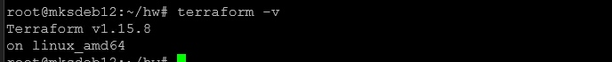
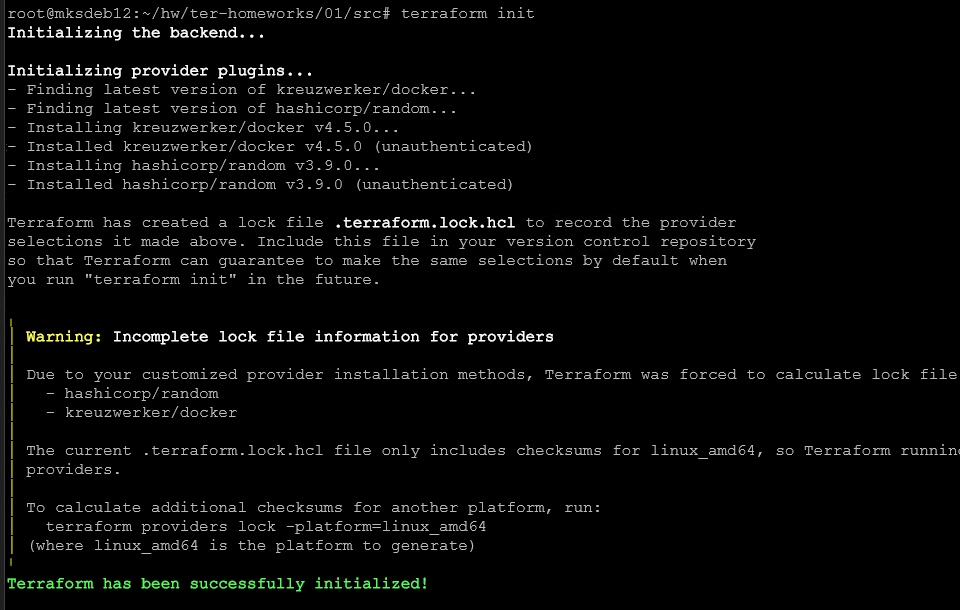
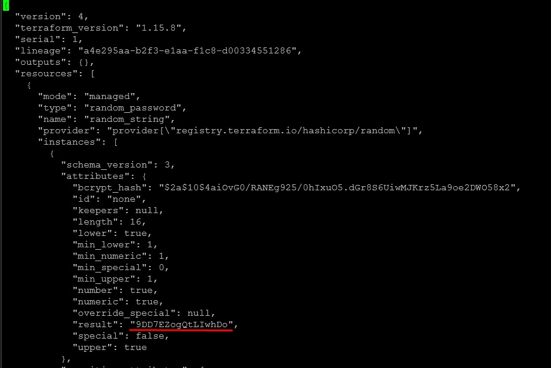
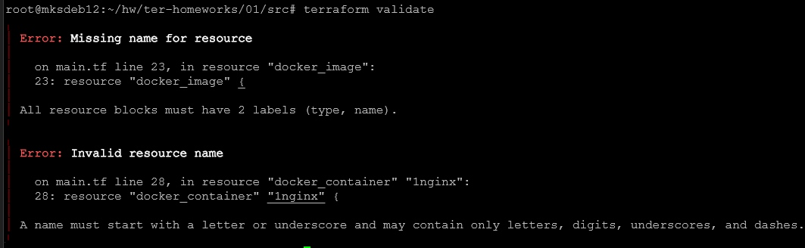
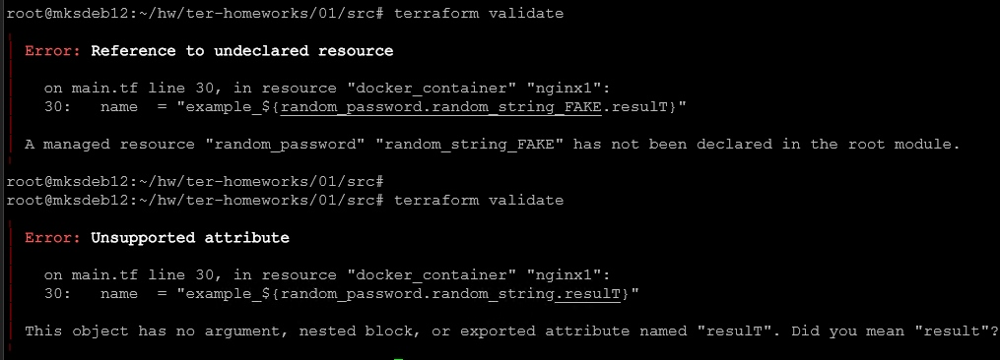
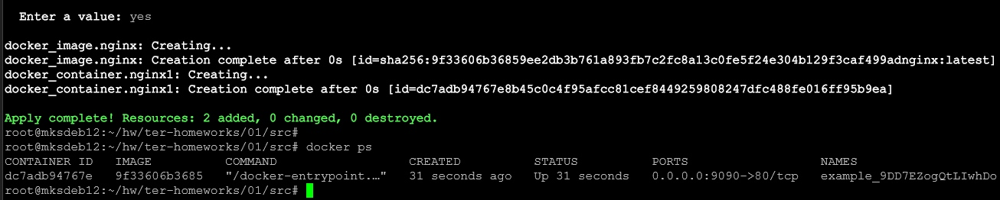
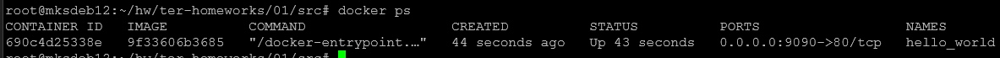
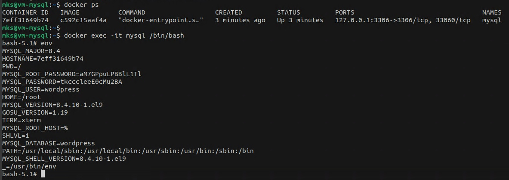

# Домашнее задание к занятию "`Введение в Terraform`" - `Милованов Константин`
[Домашнее задание](https://github.com/netology-code/ter-homeworks/blob/main/01/hw-01.md)


## Задание 1

Версия Terraform:



Перейдите в каталог src. Скачайте все необходимые зависимости, использованные в проекте - terraform init:



Изучите файл .gitignore. В каком terraform-файле, согласно этому .gitignore, допустимо сохранить личную, секретную информацию?

```
Ответ: Секретную информацию допустимо хранить в файле personal.auto.tfvars. Кроме того, в удаленный репозиторий не будут выгружаться файлы вида *.tfstate и *.tfstate.*.
```

Выполните код проекта. Найдите в state-файле секретное содержимое созданного ресурса random_password, пришлите в качестве ответа конкретный ключ и его значение.
```
"result": "9DD7EZogQtLIwhDo"
```



Раскомментируйте блок кода, примерно расположенный на строчках 29–42 файла main.tf. Выполните команду terraform validate. Объясните, в чём заключаются намеренно допущенные ошибки. Исправьте их.



```
Ответ: все блоки resource должны иметь 2 лейбла - type, name. Исправляю: добавляю имя "nginx" для блока - resource "docker_image". Это Имя, на которое далее ссылается блок "docker_container".
Блок resource "docker_container" содержит ошибку в лейбле "1nginx". Имя ресурса должно начинаться с буквы или подчеркивания. Поэтому исправляю: перемещаю единицу в конец: "nginx1".
После исправления этих ошибок появляется еще одна:
"random_password" "random_string_FAKE" has not been declared in the root module
из-за того что в последнем блоке неверная ссылка на ресурс "random_password". Также ключ "resulT" соддержит большую букву "T", но правильный ключ содержит все буквы строчные.
```



Исправляю на "random_password.random_string.result". Исправленный фрагмент кода:
```
resource "docker_image" "nginx" {
  name         = "nginx:latest"
  keep_locally = true
}

resource "docker_container" "nginx1" {
  image = docker_image.nginx.image_id
  name  = "example_${random_password.random_string.result}"

  ports {
    internal = 80
    external = 9090
  }
}
```

Выполните код. В качестве ответа приложите: исправленный фрагмент кода и вывод команды docker ps.



Замените имя docker-контейнера в блоке кода на hello_world.

```
resource "docker_container" "nginx1" {
  image = docker_image.nginx.image_id
#  name  = "example_${random_password.random_string.result}"
  name = "hello_world"

```

Выполните команду terraform apply -auto-approve. Объясните своими словами, в чём может быть опасность применения ключа -auto-approve. Догадайтесь или нагуглите зачем может пригодиться данный ключ? В качестве ответа дополнительно приложите вывод команды docker ps.

Вывод команды docker ps:


```
Ответ: опасность применения ключа -auto-approve состоит в том, что мы не сможем, посмотрев глазами plan, увидеть и остановить выполнение, если что-то в плане не так. И далее может произойти, например:
- терраформ без спроса может удалить (destroy) текущий работающий ресурс, со всем данными которые там были. В нашем случае он удалил работающий контейнер и вместо него поднял новый, просто потому что мы сменили имя контейнера.
- если кто-то вручную что-то поправил в обход terraform, а вы запускаете apply -auto-approve, Terraform попытается вернуть всё «как в коде», что может привести к непоправимым последствиям.
- если в коде была опечатка или логическая ошибка, -auto-approve сразу применит её в облаке, не дав шанса изучить план изменений.

Зачем может пригодиться данный ключ:
- Автоматизация в CI/CD конвейерах. В пайплайнах нет живого человека, который мог бы ввести yes с клавиатуры. Там этот флаг обязателен.
- Разработка и тестирование (Dev/Тест среды). При частой итеративной сборке и удалении тестовых стендов ручное подтверждение только замедляет процесс.
- Скрипты, которые ночью по расписанию (cron) что-то делают для профилактики или контроля, при которых не может случиться потери важных данных.
```

Уничтожьте созданные ресурсы с помощью terraform. Убедитесь, что все ресурсы удалены. Приложите содержимое файла terraform.tfstate.
```
Ответ: terraform destroy уничтожил ресурсы, docker ps не выдает живых контейнеров, содержимое файла terraform.tfstate:
```

```
{
  "version": 4,
  "terraform_version": "1.15.8",
  "serial": 11,
  "lineage": "a4e295aa-b2f3-e1aa-f1c8-d00334551286",
  "outputs": {},
  "resources": [],
  "check_results": null
}
```

Объясните, почему при этом не был удалён docker-образ nginx:latest. Ответ ОБЯЗАТЕЛЬНО НАЙДИТЕ В ПРЕДОСТАВЛЕННОМ КОДЕ, а затем ОБЯЗАТЕЛЬНО ПОДКРЕПИТЕ строчкой из документации terraform провайдера docker.

```
Ответ: в коде есть строка
"keep_locally = true"
В документации написано, что если значение true, то Docker-образ не будет удален при операции destroy. Если значение false, то он будет удален из локального докер-хранилища.
"keep_locally (Boolean) If true, then the Docker image won't be deleted on destroy operation. If this is false, it will delete the image from the docker local storage on destroy operation."
```


---

## Задание 2

Используя terraform и remote docker context, скачайте и запустите на вашей ВМ контейнер mysql:8 на порту 127.0.0.1:3306, передайте ENV-переменные. Сгенерируйте разные пароли через random_password и передайте их в контейнер, используя интерполяцию из примера с nginx.

Зайдите на вашу ВМ , подключитесь к контейнеру и проверьте наличие секретных env-переменных с помощью команды env. Запишите ваш финальный код в репозиторий.



[Код Terraform для удаленного Docker](./task_2/main.tf)

